# Web Game Hub 设计文档

> 基于 Cloudflare Workers + D1 + WebRTC + IndexedDB 的轻量 Web 游戏与联机游戏平台。

## 1. 项目概述

Web Game Hub 是一个无需安装 App 的 Web 游戏平台，支持：

- 原生 HTML5 游戏
- Canvas / WebGL 游戏
- WebAssembly 游戏
- EmulatorJS 等 Web 模拟器游戏
- 单机游戏
- 多人联机
- 手机触屏虚拟手柄
- 蓝牙 / USB Gamepad
- 局域网联机
- 手机热点联机
- Internet WebRTC P2P 联机
- QR Code / Link 邀请
- 房主本地游戏进度保存

核心设计原则：

> **Cloudflare 负责房间控制，不负责游戏运行。**
>
> **游戏状态、Save State、游戏数据全部保存在房主浏览器本地。**
>
> **实时游戏数据尽可能直接通过 LAN / WebRTC 在玩家之间传输。**

---

# 2. 总体架构

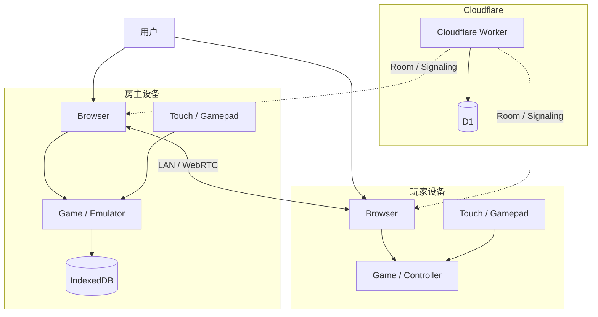

---

# 3. 系统分层

系统分成三个平面。

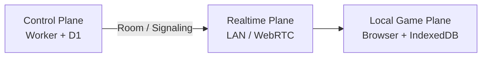

## 3.1 Control Plane

由 Cloudflare Worker + D1 提供。

负责：

- 创建房间
- 加入房间
- 房间生命周期
- 玩家管理
- 房主心跳
- Join Token
- 房间邀请 URL
- QR Code 对应信息
- WebRTC Signaling
- 房间状态

不负责：

- 游戏运行
- 游戏画面
- 游戏输入实时转发
- Save State
- 游戏状态
- ROM
- 游戏数据

---

## 3.2 Realtime Plane

负责实时通信。

优先级：

1. LAN
2. WebRTC P2P
3. 必要时再考虑 Relay

主要传输：

- Controller Input
- Frame Number
- Synchronization Event
- Game Event
- Connection Status
- Host Heartbeat

原则：

> Worker 不参与正常游戏实时数据传输。

---

## 3.3 Local Game Plane

运行在用户浏览器。

负责：

- 游戏执行
- EmulatorJS
- 游戏渲染
- 输入处理
- 游戏状态
- Save State
- 游戏配置
- 本地游戏数据

主要存储：

```text
IndexedDB
```

---

# 4. 游戏类型

平台支持三类游戏。

## 4.1 HTML5 Game

例如：

```text
Snake
Tetris
2048
Chess
小游戏
```

游戏可以直接使用：

```text
HTML
CSS
JavaScript
Canvas
WebGL
WebAssembly
```

---

## 4.2 Emulator Game

例如：

```text
NES
SNES
GBA
GB
PS1
```

通过：

```text
EmulatorJS
```

或者其他 Web Emulator Runtime。

---

## 4.3 Game Manifest

每个游戏通过 Manifest 描述。

示例：

```json
{
  "id": "snake",
  "name": "Snake",
  "version": "1.0.0",
  "type": "html",

  "players": 2,

  "controller": {
    "type": "generic"
  },

  "multiplayer": {
    "supported": true,
    "sync": "input"
  },

  "entry": "/games/snake/index.html"
}
```

EmulatorJS：

```json
{
  "id": "mario-nes",
  "name": "Super Mario Bros.",
  "version": "1.0.0",
  "type": "emulator",

  "engine": "emulatorjs",
  "core": "nes",

  "players": 2,

  "controller": {
    "type": "nes"
  },

  "multiplayer": {
    "supported": true,
    "sync": "input"
  }
}
```

---

# 5. 房间模型

房间由房主创建。

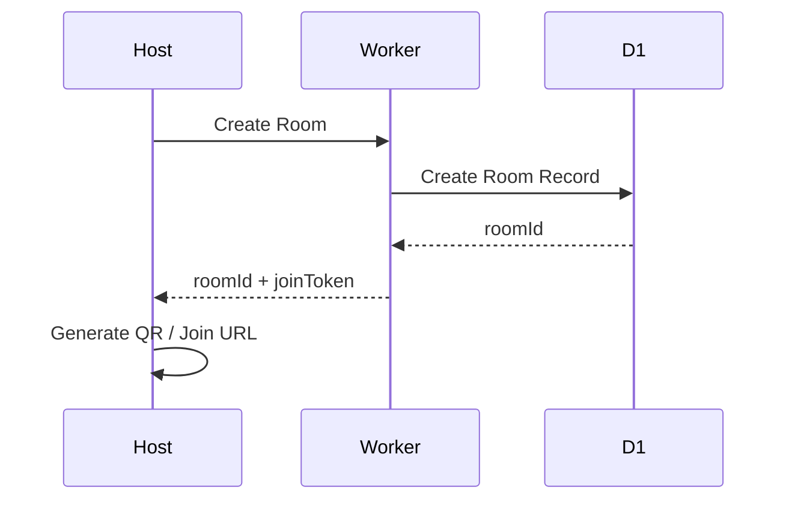

房间包含：

```text
roomId
gameId
hostId
status
mode
createdAt
lastHeartbeat
```

---

# 6. 房间生命周期

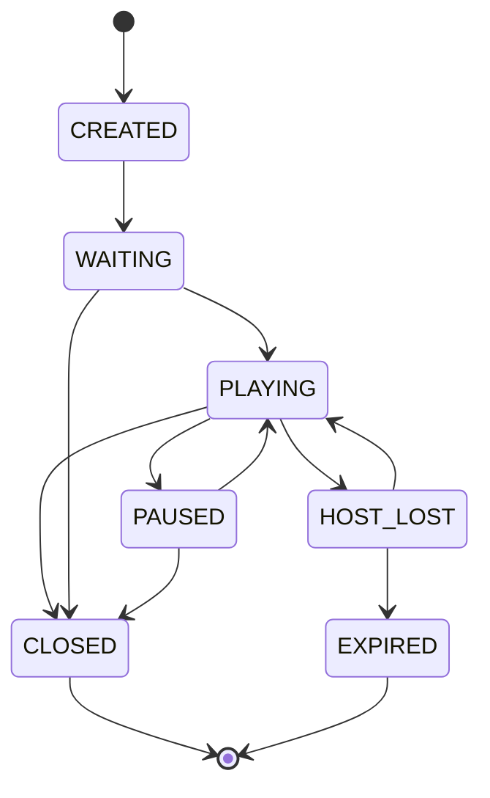

---

# 7. 房间状态

## CREATED

房间刚创建。

## WAITING

等待玩家加入。

## PLAYING

游戏运行中。

## PAUSED

游戏暂停。

## HOST_LOST

房主暂时断开。

## CLOSED

房主主动关闭。

## EXPIRED

房主长时间没有恢复。

---

# 8. 邀请机制

每个房间生成：

```text
Room ID
Join Token
Join URL
QR Code
```

例如：

```text
https://game.example.com/join/A8F3K9
```

QR Code 内容就是 Join URL。

---

# 9. Nearby 联机

Nearby 表示玩家物理位置较近。

目标：

```text
同一个 Wi-Fi
```

或者：

```text
房主手机热点
```

---

## 9.1 Nearby 流程

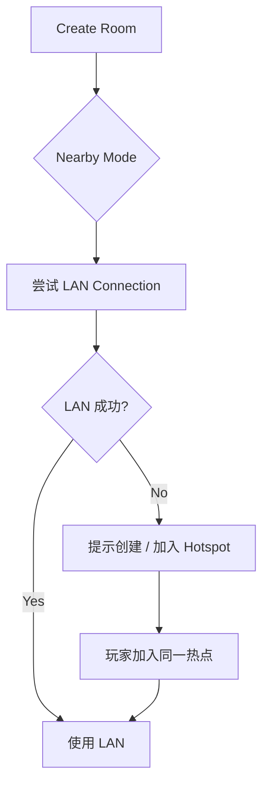

浏览器无法可靠获得：

- Wi-Fi SSID
- BSSID
- 网络拓扑

因此不依赖“检测 SSID 判断是否同一 Wi-Fi”。

实际采用：

> **能力探测 + 连接尝试**

---

# 10. LAN 连接

LAN 模式下：

```text
Host
  │
  │ Local Network
  │
Client
```

目标：

- 低延迟
- 不经过公网
- 不经过 Cloudflare
- 游戏数据本地传输

---

# 11. Hotspot

当房主没有可用 Wi-Fi 时，可以：

```text
Host
 ↓
Create Personal Hotspot
 ↓
Players connect
 ↓
Open Join URL
 ↓
LAN Connection
```

浏览器无法直接替用户创建系统热点，因此需要用户执行：

> 打开个人热点 → 玩家连接 → 扫码进入。

---

# 12. Remote 联机

远程模式使用 WebRTC。

```mermaid
sequenceDiagram

    participant H as Host
    participant W as Worker
    participant C as Client

    H->>W: Create Room
    W-->>H: Room ID

    H->>C: Share Join URL

    C->>W: Join Room
    W-->>C: Room Info

    H->>W: WebRTC Offer
    W->>C: Offer

    C->>W: WebRTC Answer
    W->>H: Answer

    H->>C: ICE Candidate
    C->>H: ICE Candidate

    H<-->C: WebRTC P2P

    Note over H,C: Worker 不再参与游戏数据传输
```

---

# 13. WebRTC 数据通道

使用：

```text
RTCDataChannel
```

例如：

```text
input
sync
event
control
```

---

# 14. Input Protocol

统一输入协议。

```json
{
  "type": "input",
  "frame": 183920,
  "player": 1,
  "button": "A",
  "pressed": true
}
```

按钮统一：

```text
UP
DOWN
LEFT
RIGHT

A
B
X
Y

L
R

START
SELECT
```

不同游戏通过 Controller Mapping 转换。

---

# 15. Controller 架构

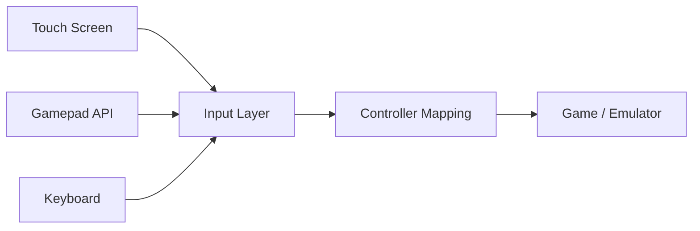

---

# 16. 手机作为独立控制器

手机可以不运行游戏，仅运行 Controller UI。

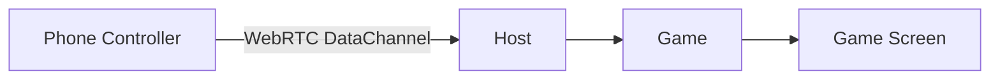

例如：

```text
        ↑

    ←   ○   →

        ↓

             X

       Y           A

             B

       SELECT  START
```

---

# 17. Gamepad

浏览器通过：

```text
Gamepad API
```

支持：

- Bluetooth Controller
- USB Controller
- PC Gamepad

统一转换为平台 Input Event。

---

# 18. 游戏同步

第一阶段采用：

> **Input Synchronization**

而不是视频同步。

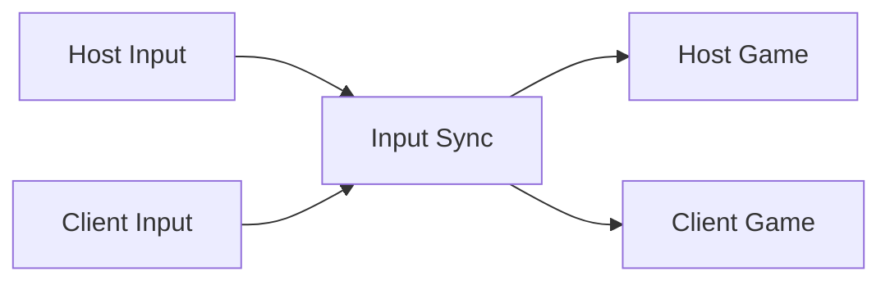

---

# 19. 为什么不直接同步画面

不采用：

```text
Game
 ↓
Screen Capture
 ↓
Video Stream
 ↓
WebRTC
```

原因：

- 带宽更高
- 延迟更高
- 手机发热
- 视频编码成本
- 画面质量依赖网络

优先采用：

```text
Input
 ↓
WebRTC
 ↓
Local Emulator
 ↓
Local Rendering
```

---

# 20. Deterministic Game

对于支持确定性模拟的游戏：

```text
Same ROM
Same Emulator
Same Version
Same Initial State
Same Input Sequence
```

理论上：

```text
Host State == Client State
```

因此同步：

```text
Input
Frame
Seed
Event
```

而不是完整游戏状态。

---

# 21. 第一阶段同步协议

```json
{
  "type": "input",
  "frame": 1000,
  "player": 2,
  "input": {
    "left": true,
    "right": false,
    "A": true,
    "B": false
  }
}
```

后续可以增加：

```text
state_hash
checkpoint
resync
rollback
```

---

# 22. Local Storage

游戏状态全部保存在房主浏览器。

推荐：

```text
IndexedDB
```

不推荐：

```text
localStorage
```

用于大型游戏状态。

---

# 23. IndexedDB 设计

```text
WebGameHub
│
├── games
│
├── saves
│
├── emulator_states
│
├── settings
│
└── local_rooms
```

---

# 24. Save 数据

例如：

```text
saves
----------------
gameId
slot
data
updatedAt
```

其中：

```text
data = ArrayBuffer / Blob / JSON
```

---

# 25. Save API

平台提供统一接口：

```javascript
GameStorage.save(slot, data)
GameStorage.load(slot)
GameStorage.delete(slot)
GameStorage.list()
```

游戏无需知道存储实现。

---

# 26. 房主异常断线

房主是：

> Authoritative Host

房主异常：

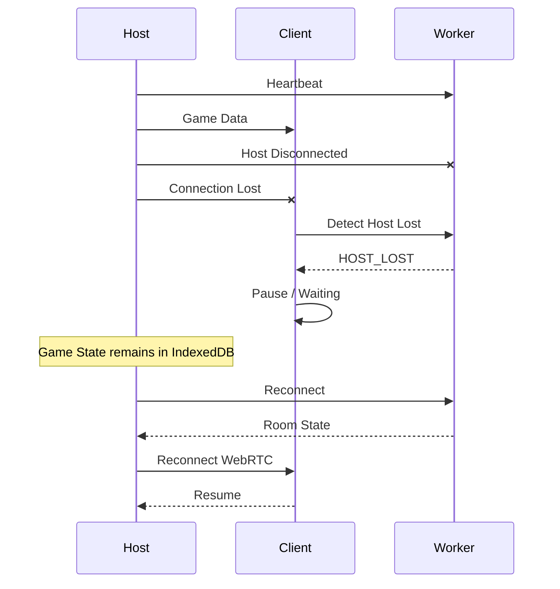

---

# 27. Save 策略

游戏运行期间：

```text
Game
 ↓
IndexedDB
```

可以按照游戏自身逻辑保存：

```text
自动保存
手动保存
Checkpoint
Emulator Save State
```

服务器完全不知道 Save State。

---

# 28. 房主关闭网页

例如：

```text
Host Browser Closed
```

服务器：

```text
Room
 ↓
Host heartbeat timeout
 ↓
HOST_LOST
 ↓
Room expired
```

但本地：

```text
IndexedDB
 ↓
Save State remains
```

下次打开：

```text
Game
 ↓
Load Local Save
 ↓
Continue
```

---

# 29. Server 数据模型

## rooms

```sql
CREATE TABLE rooms (
    id TEXT PRIMARY KEY,
    game_id TEXT NOT NULL,
    host_id TEXT NOT NULL,
    status TEXT NOT NULL,
    mode TEXT NOT NULL,
    created_at INTEGER NOT NULL,
    updated_at INTEGER NOT NULL,
    last_heartbeat INTEGER
);
```

## players

```sql
CREATE TABLE players (
    id TEXT PRIMARY KEY,
    room_id TEXT NOT NULL,
    nickname TEXT,
    role TEXT NOT NULL,
    joined_at INTEGER NOT NULL,
    last_seen INTEGER
);
```

## sessions

```sql
CREATE TABLE sessions (
    id TEXT PRIMARY KEY,
    room_id TEXT NOT NULL,
    token_hash TEXT NOT NULL,
    expires_at INTEGER NOT NULL,
    created_at INTEGER NOT NULL
);
```

---

# 30. D1 不保存的数据

以下数据原则上不进入 D1：

```text
Game Save
Save State
ROM
Game State
Frame Buffer
Video
Input History
Player Personal Files
```

---

# 31. Worker API

建议：

```text
POST /api/rooms
POST /api/rooms/:id/join
POST /api/rooms/:id/leave
POST /api/rooms/:id/heartbeat
GET  /api/rooms/:id

POST /api/rooms/:id/signal
DELETE /api/rooms/:id
```

---

# 32. Room 创建

```http
POST /api/rooms
```

Request：

```json
{
  "gameId": "snake",
  "mode": "remote"
}
```

Response：

```json
{
  "roomId": "A8F3K9",
  "joinUrl": "https://game.example.com/join/A8F3K9",
  "expiresAt": 1790000000
}
```

---

# 33. Join

```http
POST /api/rooms/A8F3K9/join
```

Response：

```json
{
  "roomId": "A8F3K9",
  "gameId": "snake",
  "host": true,
  "signaling": true
}
```

---

# 34. Heartbeat

房主定期：

```text
POST /api/rooms/:id/heartbeat
```

建议：

```text
10~30 seconds
```

Worker 更新：

```text
last_heartbeat
```

如果超时：

```text
HOST_LOST
```

---

# 35. Security

## Join Token

Join URL 不应该直接暴露数据库内部 ID。

例如：

```text
https://game.example.com/join/
A8F3K9-xxxxxxxx
```

Token 应该：

- 随机生成
- 不可预测
- 有过期时间
- 可以撤销

---

# 36. Host Token

Host Token 和 Join Token 分离。

```text
Host Credential
        ≠
Join Credential
```

Host Token 用于：

```text
修改房间
关闭房间
Host reconnect
管理玩家
```

Join Token 只能：

```text
查看房间
加入房间
建立连接
```

---

# 37. 房间权限

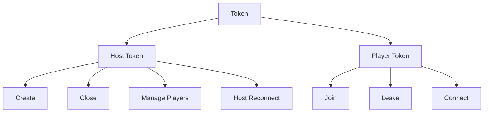

---

# 38. 数据流原则

正常游戏：

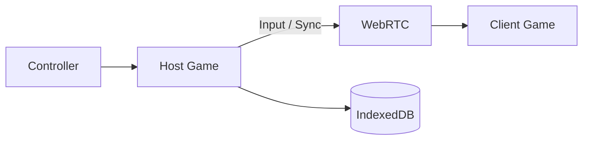

Cloudflare：

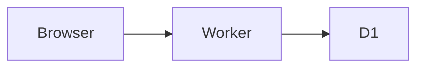

两条路径相互独立。

---

# 39. 网络选择策略

最终策略：

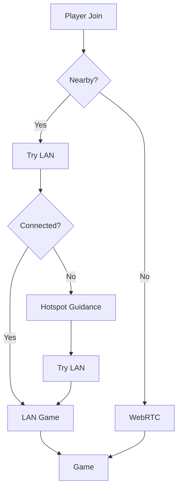

注意：

> Nearby 不依赖浏览器读取 Wi-Fi 信息，而是通过实际连接能力判断。

---

# 40. PWA

建议平台支持 PWA。

```text
Web
 ↓
Install
 ↓
Home Screen
 ↓
Game Hub
```

优势：

- 无需 App Store
- 无需安装原生 App
- 可以缓存游戏
- 可以离线运行部分游戏
- 可以作为游戏平台入口

---

# 41. Offline 游戏

游戏资源可以缓存：

```text
Service Worker
 ↓
Cache Storage
```

结构：

```text
Game Hub
 ├── HTML
 ├── JS
 ├── WASM
 ├── Assets
 └── Emulator
```

游戏运行时甚至可以完全不访问 Cloudflare。

---

# 42. 推荐项目结构

```text
web-game-hub/
│
├── apps/
│   └── web/
│
├── worker/
│   ├── routes/
│   ├── room/
│   ├── signaling/
│   └── auth/
│
├── games/
│   ├── snake/
│   ├── tetris/
│   └── ...
│
├── emulator/
│   └── emulatorjs/
│
├── controller/
│   ├── touch/
│   └── gamepad/
│
├── storage/
│   └── indexeddb/
│
└── docs/
```

---

# 43. MVP

第一版本只实现：

```text
1. HTML5 Game
2. Create Room
3. Join Room
4. QR Code
5. WebRTC
6. Touch Controller
7. Gamepad
8. IndexedDB Save
```

流程：

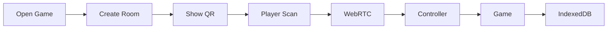

---

# 44. 第二阶段

增加：

```text
EmulatorJS
LAN
Hotspot Guidance
Multiple Players
Gamepad Mapping
Game Manifest
PWA
```

---

# 45. 第三阶段

增加：

```text
Deterministic Sync
State Hash
Resync
Rollback
Host Migration
更多 Emulator Core
```

---

# 46. Host Migration

后期可以支持：

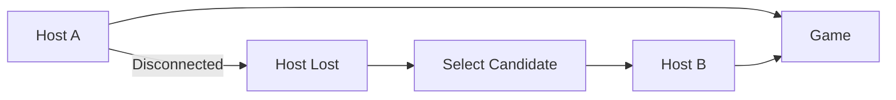

但第一版不实现。

第一版：

> Host 断开 → 游戏暂停 → 等待 Host 恢复。

---

# 47. 核心设计原则

整个项目遵循以下原则：

### 1. Serverless Game

游戏不依赖服务器运行。

### 2. Local First

游戏数据优先保存在用户设备。

### 3. P2P First

实时数据优先走 LAN / WebRTC。

### 4. Cloudflare Control Only

Cloudflare 负责：

```text
Room
Identity
Signaling
Heartbeat
```

不负责：

```text
Game State
Save
Video
Input Relay
```

### 5. Host Authoritative

房主负责：

```text
Game Runtime
Game State
Save State
Room Host
```

### 6. Controller Independent

游戏只认识统一 Input API：

```text
Touch
Gamepad
Keyboard
Remote Phone
```

最终都转换成：

```text
InputEvent
```

---

# 48. 最终架构

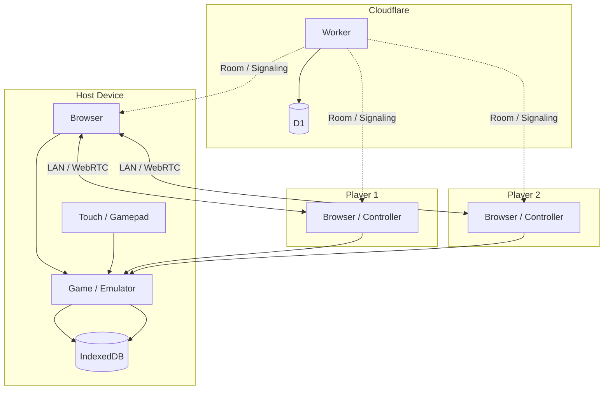

---

# 49. 产品核心定义

**Web Game Hub 是一个 Local-First、P2P 优先的 Web 游戏平台。**

用户无需安装 App：

```text
打开网页
    ↓
选择游戏
    ↓
创建 / 加入房间
    ↓
扫码或分享链接
    ↓
手机成为控制器
    ↓
LAN / WebRTC 联机
    ↓
游戏运行在房主设备
    ↓
游戏进度保存在房主浏览器
```

Cloudflare 只负责让玩家：

> **找到房间、加入房间、建立连接。**

真正的游戏：

> **始终运行在用户自己的设备上。**

---

# 50. 推荐技术栈

| 模块 | 技术 |
|---|---|
| Frontend | 原生 TypeScript / JavaScript |
| Game | HTML5 / Canvas / WebGL |
| Emulator | EmulatorJS |
| Local Storage | IndexedDB |
| Offline | Service Worker / Cache API |
| Controller | Touch + Gamepad API |
| Nearby | LAN |
| Remote | WebRTC |
| Signaling | Cloudflare Worker |
| Database | Cloudflare D1 |
| Hosting | Cloudflare Pages / Workers |
| QR | Browser QR Library |
| Authentication | 可选，不作为 MVP 必需 |

---

# 51. 非目标

MVP 阶段不做：

- 云端游戏存档
- 游戏视频转发
- 游戏状态上传服务器
- 游戏服务器
- 原生 iOS App
- 原生 Android App
- Host Migration
- 复杂账号体系
- 游戏内社交系统
- 游戏排行榜

这样可以保持项目足够轻量。

---

# 52. 一句话架构

```text
Cloudflare 管房间，
WebRTC/LAN 管实时连接，
房主浏览器跑游戏，
IndexedDB 管存档，
手机/手柄管输入。
```

这就是整个 Web Game Hub 的核心架构。